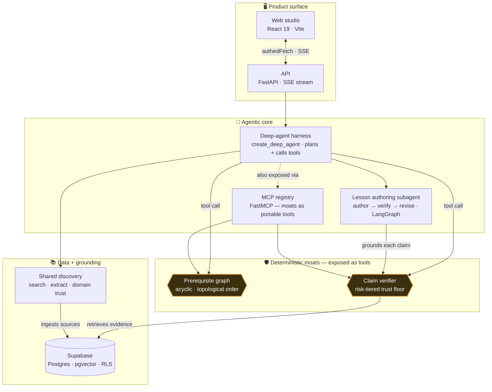

<div align="center">


# Lunaris

**Turn a topic into a real, verified course — built by an agent, guaranteed by code.**

Type a subject. An agent plans the curriculum, writes the lessons, orders every prerequisite, and
grounds every factual claim against evidence — then hands you a prerequisite map, Merrill‑structured
lessons, branded diagrams, and claims that carry their sources.

[](LICENSE)
[](.python-version)
[](apps/web)
[](apps/api)
[](supabase)
[](packages/agent)
[](#configuration)

[Why it exists](#why-it-exists) ·
[Architecture](#architecture) ·
[Pipeline](#the-build-pipeline) ·
[Quick start](#quick-start) ·
[Configuration](#configuration) ·
[Docs](#documentation)

</div>

---

## Why it exists

Most "AI course generators" free‑hand an answer in one shot — plausible, unordered, and unsourced.
Lunaris keeps two correctness guarantees in **deterministic code**, exposed to the agent **as tools**
so the model cannot talk its way past them:

| | Failure mode | The moat |
|---|---|---|
| **A** | A concept is taught before its prerequisites | A **prerequisite‑graph builder** guarantees an acyclic, topologically‑ordered curriculum |
| **B** | An unsupported claim ships as fact | A **claim‑level verifier** grounds every factual sentence against retrieved evidence and cuts what it can't support |

> The agent reasons about *what to do next*; the moats and a deterministic finalize step guarantee
> *what ships*.

### Relevant, not just correct

Ordering and grounding don't make a course about the *right thing at the right level*. Ask for
*"Improve my English to CLB 10"* (an advanced band) and a naive generator starts from *"the English
alphabet"* — coherent, correctly ordered, and useless. So Lunaris runs the front of the pipeline a good
tutor runs first: **interpret** the request into a typed goal‑for‑a‑learner brief → **research** the
real standard → **model the learner's frontier** (what to skip) → **scope to the gap** → design backward
and **curate** vetted resources. The moats then operate over *relevant, scoped* input. → [relevance‑model.md](documentation/relevance-model.md)

### Grounded, and auditable

Grounding isn't a binary check. Every source carries a **trust tier** (official / reputable / open /
blocked, plus **vouched** for sources you supply), a **source type**, and a **credibility score** —
constructed at acquisition and shown on the citation. On a high‑risk course the verifier applies a
**risk‑tiered trust floor**: evidence must be curated‑or‑better *and* credible, **or** corroborated
across ≥2 independent domains — otherwise the claim is cut. **Authority emerges from agreement, not from
a label** (and the LLM judges stay blind to source labels while you see the full trust). → [grounding‑model.md](documentation/grounding-model.md)

## Architecture

A conventional product surface (web + API + Supabase) wraps an **agentic core**: a deep‑agent harness
plans the build and calls every capability — including the two deterministic moats — as **tools**.



| Layer | Package / app | What it owns |
|---|---|---|
| **Agent harness** | `packages/agent` · `lunaris_agent.harness` | `create_deep_agent` planner; runs the relevance front, calls the moat tools, delegates Merrill authoring to the LangGraph **author → verify → revise** subagent. Default pipeline (`LUNARIS_PIPELINE=agent`). |
| **Prerequisite moat** | `packages/graph` · `PrerequisiteGraphBuilder` | Pairwise prereq judgements assembled into a guaranteed‑acyclic, minimal‑edge, topologically‑ordered graph. |
| **Grounding moat** | `packages/grounding` · `Verifier` + `PgVectorRetriever` | Per‑claim evidence retrieval (pgvector + Voyage) and an independent support assessor with the trust floor; nothing unsupported ships. |
| **Shared discovery** | `packages/grounding.discovery` | One search provider (Tavily) + extractor (Trafilatura) + domain‑trust model, shared by research and resource curation; key‑gated, deterministic stubs otherwise. |
| **MCP registry** | `lunaris_agent.mcp_registry` | The two moats as portable FastMCP tools (`build_prerequisite_graph`, `verify_claims`). |
| **Runtime** | `packages/runtime` | Pydantic course schema, persistence, structlog logging (correlation IDs + redaction), resilience + credential seams. |
| **API** | `apps/api` · FastAPI | Course create + SSE build stream, live agent transcript, corpus, capabilities, per‑tenant credentials. |
| **Web** | `apps/web` · React 19 | Studio: run‑history sidebar, live build timeline, lesson **Reader**, prerequisite **Map**, Corpus + Settings. |
| **Eval** | `packages/eval` · `lunaris-eval` | Independent, offline checkers for the definition of done (prereq order + factuality). |

The model provider is **Anthropic Claude** (a strong + worker tier); embeddings are **Voyage AI**. Full
system design, sequence, and deployment diagrams: **[documentation/architecture.md](documentation/architecture.md)**.

## The build pipeline

Every stage is a **tool the planning agent calls**, writing its typed result onto a shared `CourseDraft`.
Two stages (◆) are the deterministic moats.

```mermaid
flowchart LR
    A["interpret<br/>request"] --> B["research<br/>standard"] --> C["model<br/>learner"] --> D["extract<br/>concepts"]
    D --> E{{"prerequisite<br/>graph ◆"}}
    E --> F["design<br/>curriculum"] --> G["seed +<br/>discover grounding"]
    G --> H["author<br/>lessons"] --> I{{"verify<br/>claims ◆"}}
    I --> J["curate<br/>resources"] --> K["coverage<br/>gate"] --> L(["📘 Course"])

    classDef moat fill:#3b2f10,stroke:#e8a33d,stroke-width:2px,color:#fff;
    class E,I moat
```



Step‑by‑step with real values from a live build: **[documentation/course-build-pipeline.md](documentation/course-build-pipeline.md)**.

## Quick start

One command, from a fresh clone:

```bash
make run
```

This installs everything (uv + the Python workspace + web deps), brings up Supabase + the API + the web
dev server, and opens the studio. **Pipeline selection is automatic:** with a reachable
`ANTHROPIC_API_KEY` (in `.env` or the in‑app Settings) it serves the **real agent harness**; with no key
it falls back to the deterministic **stub** pipeline (instant, always works) and says so. Force a mode
with `LUNARIS_PIPELINE=agent|live|stub`.

```bash
make            # command reference
make start      # backend only (Supabase + API)
make stop       # tear down (Supabase data preserved)
make test       # Python + web suites
make lint       # ruff + typecheck + eslint gates
```

## Configuration

Configuration lives in `.env` (copied from `.env.sample` on first run). **Every external key is
optional** — each unlocks a live capability and its absence falls back to a deterministic stub, so the
no‑key path always works:

| Key | Unlocks | Absent |
|---|---|---|
| `ANTHROPIC_API_KEY` | Live Claude — the `agent`/`live` pipelines, the relevance front, every `-m eval` | The deterministic `stub` pipeline (or a keyless **Draft** tier — see below) |
| `SEARCH_API_KEY` (Tavily) | Standard research + curated per‑lesson resources (metered, per‑build budget) | `research: unavailable`, no resources — still builds at the right level |
| `YOUTUBE_API_KEY` | Richer video resources (duration / channel) | Video candidates via the shared search |
| `EMBEDDINGS_API_KEY` (Voyage) + Supabase | Real pgvector grounding → claim‑level citations | The verifier fails safe (cuts every claim → *Needs review*) |

> **Keyless Draft mode.** An account with *no* keys can still build end‑to‑end in a labelled **Draft**
> tier backed by fully self‑hosted fallbacks (a local Qwen LLM + BGE embeddings + DuckDuckGo search) —
> degraded quality, clearly marked, no third‑party key required.

## Documentation

Minimal by design — four focused docs plus the system‑design reference:

| Doc | Read it for |
|---|---|
| **[architecture.md](documentation/architecture.md)** | System‑design, sequence, and deployment diagrams (Mermaid) |
| [course-build-pipeline.md](documentation/course-build-pipeline.md) | The 11‑stage build, traced with real values |
| [relevance-model.md](documentation/relevance-model.md) | The interpret → research → scope front + its cost model |
| [grounding-model.md](documentation/grounding-model.md) | Trust tiers, the trust floor, the three corpus modes |
| [build-a-course-walkthrough.md](documentation/build-a-course-walkthrough.md) | A hands‑on first build |

## Development

- **Backend:** `uv run pytest -q` (deterministic, no key) · `uv run ruff check . && uv run ruff format --check .`
- **Web:** `cd apps/web && npm run dev` (or `test` / `lint` / `typecheck` / `build`)
- **Live evals (real key):** `uv run --env-file .env pytest -m eval -q`
- **Score a course vs the definition of done:** `uv run lunaris-eval <course.json>`

> Project‑internal engineering standards, agents, and skills live under `.claude/` (gitignored) and are
> not shipped with the product.

## License

[GNU AGPL‑3.0](LICENSE) © Pouyan Jahangiri
