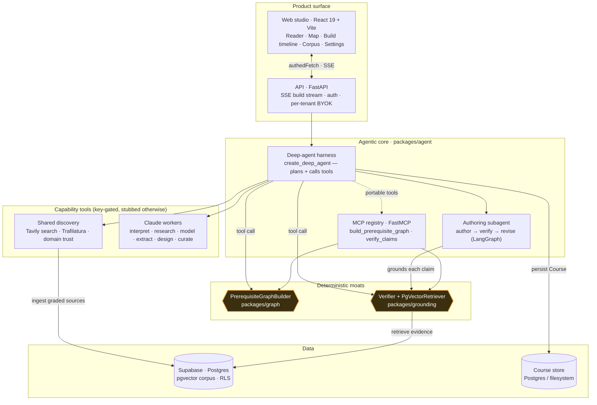
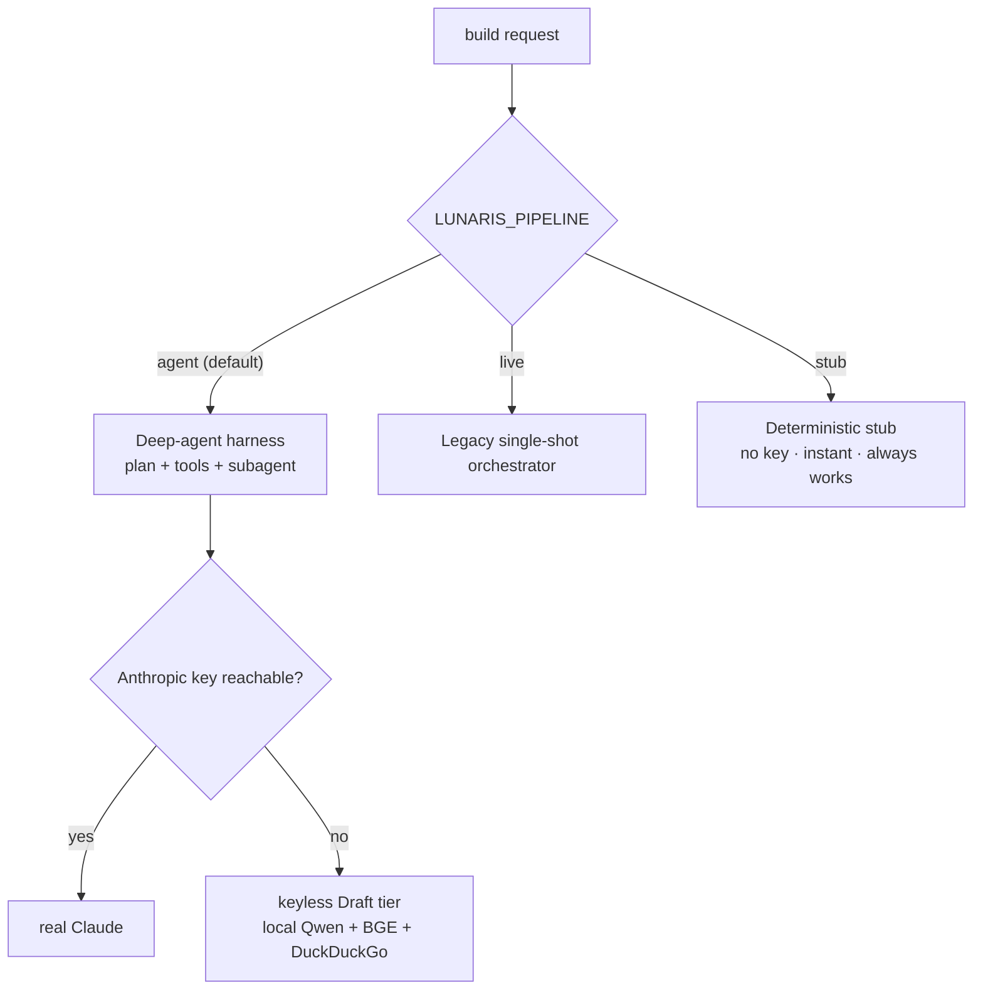
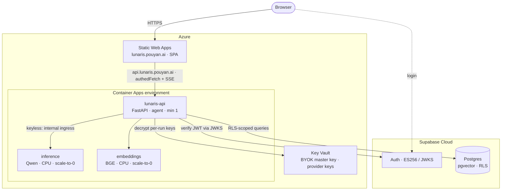

# Architecture

The system design of Lunaris in five diagrams. Lunaris is an **agent‑first** application: a conventional
product surface (web + API + Supabase) wraps a deep‑agent core that plans a course build and calls every
capability — including two deterministic correctness moats — as **tools**.

Four invariants hold across every layer (and the harness enforces them):

1. **Reasoning vs recall** — the agent reasons about plans; authoritative facts flow through capability
   tools, never the model's memory.
2. **Tools vs orchestration** — each capability is its own package; the MCP registry is a thin adapter, not a home for logic.
3. **Provenance is structural** — tool results carry where the data came from (source, trust, tool‑call id, timestamp), constructed at the source and flowing untouched to the UI.
4. **Correlation everywhere** — every run carries a `run_id` propagated via `structlog` contextvars, so one build can be traced across every layer.

---

## 1. Components

The harness exposes the same two moats **twice**: as in‑process tools to its own planner, and via the
**MCP registry** so any MCP client can call them. The registry is a thin adapter — the logic lives in
`packages/graph` and `packages/grounding`.

## 2. Build sequence

The planner drives the build by calling tools in a sensible order; each tool emits a typed
`ProgressStage` event that streams to the web timeline over SSE. The two moats (◆) are deterministic.

## 3. The authoring loop (Moat B, up close)

Lessons are authored by a LangGraph subagent that **grounds before it ships**: every factual claim is
checked against retrieved evidence, and unsupported claims trigger a bounded revise — not a rubber stamp.

The verifier's thresholds and the risk‑tiered trust floor are documented in
[grounding-model.md](grounding-model.md); the moat is never loosened to make a claim pass.

## 4. Pipeline selection

The API selects a build pipeline from `LUNARIS_PIPELINE` (`apps/api/.../config.py`), defaulting to the
agent harness and degrading safely when no model key is reachable:

## 5. Deployment (production)

Lunaris runs on Azure with Supabase Cloud for data + identity. Compute is **Azure Container Apps** (not
App Service — the long SSE build outlives a 230s gateway timeout) and **Static Web Apps** for the SPA.
The keyless Draft tier runs as scale‑to‑zero CPU inference sidecars.

**Multi‑tenancy + BYOK.** Each tenant authenticates with Supabase (ES256, verified by the API via JWKS),
rows are isolated by per‑user RLS, and each tenant supplies their **own** provider keys — stored
AES‑GCM‑encrypted (master key from Key Vault, never the DB) and injected into a run's context, never the
process environment, never logged. CI/CD is GitHub Actions (`cd-dev`, `cd-prod` build‑once‑promote,
`cd-inference`).

---

*These diagrams are the map; the deeper "why" lives in the linked docs and the code under
[`packages/`](../packages) and [`apps/`](../apps).*
