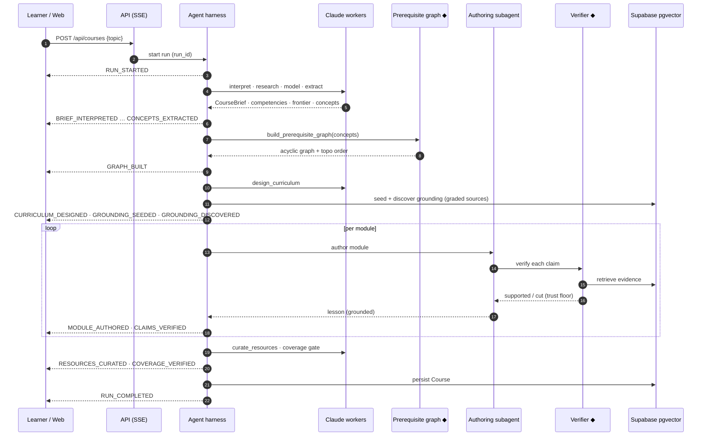
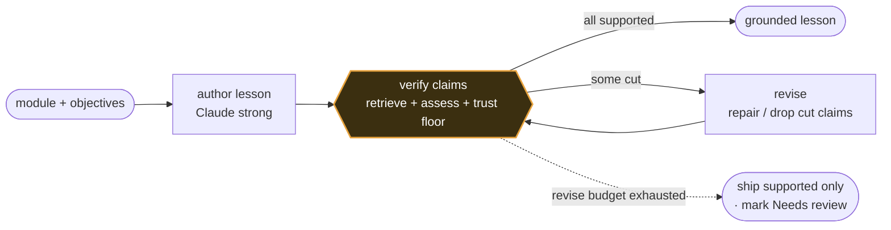
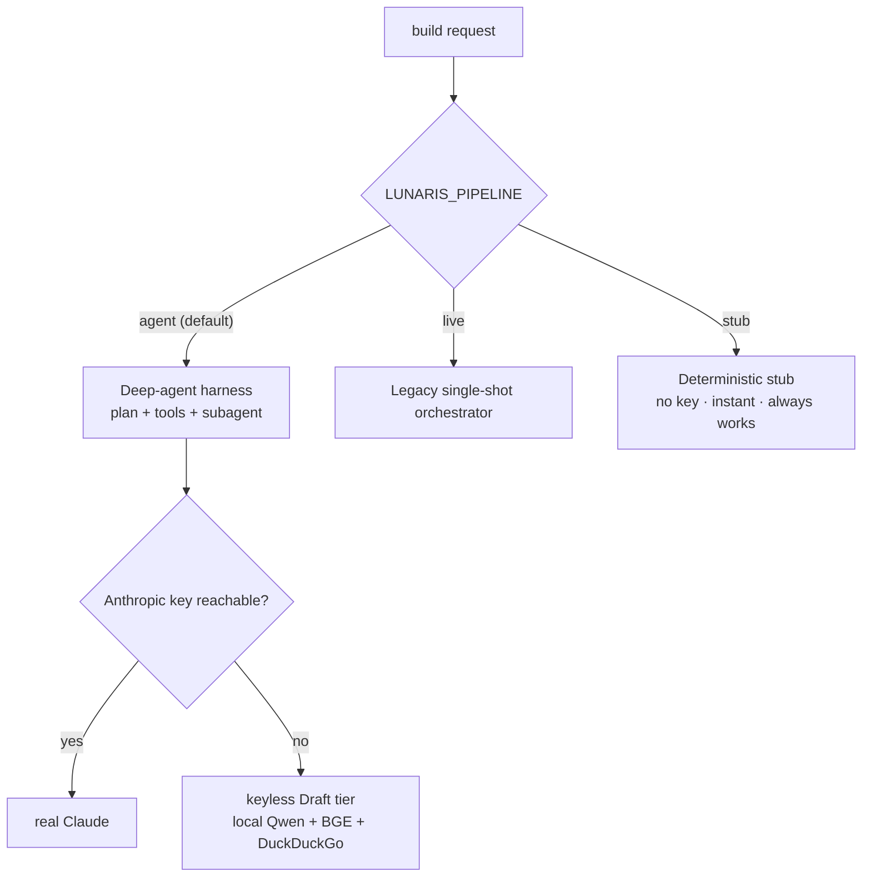

# Architecture

The system design of Lunaris in four diagrams. Lunaris is an **agent-first** application: a
conventional product surface (web + API + Supabase) wraps a deep-agent core that plans a course build
and calls every capability — including two deterministic correctness guarantees — as **tools**.

Four invariants hold across every layer, and the harness enforces them:

1. **Reasoning vs recall** — the agent reasons about plans; authoritative facts flow through
   capability tools, never the model's memory.
2. **Tools vs orchestration** — each capability is its own package; the MCP registry is a thin
   adapter, not a home for logic.
3. **Provenance is structural** — tool results carry where the data came from (source, trust,
   tool-call id, timestamp), constructed at the source and flowing untouched to the UI.
4. **Correlation everywhere** — every run carries a `run_id` propagated via `structlog` contextvars,
   so one build can be traced across every layer.

The two correctness guarantees referenced throughout these docs are:

- **Prerequisite ordering** — the prerequisite graph is acyclic and teaches in topological order; the
  model cannot reorder it. Built in [`packages/graph`](../packages/graph).
- **Claim grounding** — every factual claim is verified against retrieved evidence and either
  supported or cut; the model cannot talk an unsupported claim past it. Built in
  [`packages/grounding`](../packages/grounding).

---

## 1. Components

The harness exposes the same two guarantees **twice**: as in-process tools to its own planner, and
via the **MCP registry** so any MCP client can call them. The registry is a thin adapter — the logic
lives in `packages/graph` and `packages/grounding`.

## 2. Build sequence

The planner drives the build by calling tools in a sensible order; each tool emits a typed
`ProgressStage` event that streams to the web timeline over SSE. The two guarantees (◆) are
deterministic. The same flow is traced stage by stage, with example values, in
[build-pipeline.md](build-pipeline.md).

## 3. The authoring loop, up close

Lessons are authored by a LangGraph subagent that **grounds before it ships**: every factual claim is
checked against retrieved evidence, and unsupported claims trigger a bounded revise — not a rubber
stamp.

The verifier's thresholds and the risk-tiered trust floor are documented in
[grounding.md](grounding.md); the guarantee is never loosened to make a claim pass.

## 4. Pipeline selection

The API selects a build pipeline from `LUNARIS_PIPELINE` (`apps/api/.../config.py`), defaulting to the
agent harness and degrading safely when no model key is reachable:

When no Anthropic key is reachable, the build runs in a labelled **Draft tier** on fully local,
self-hosted models — see [deployment.md](deployment.md#the-keyless-draft-tier).

---

For how this runs in production — the Azure topology, multi-tenancy, and bring-your-own-key model —
see **[deployment.md](deployment.md)**.

*These diagrams are the map; the deeper "why" lives in the linked docs and the code under
[`packages/`](../packages) and [`apps/`](../apps).*
