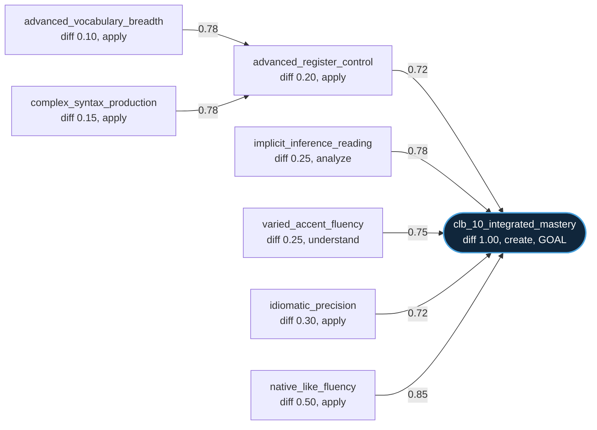
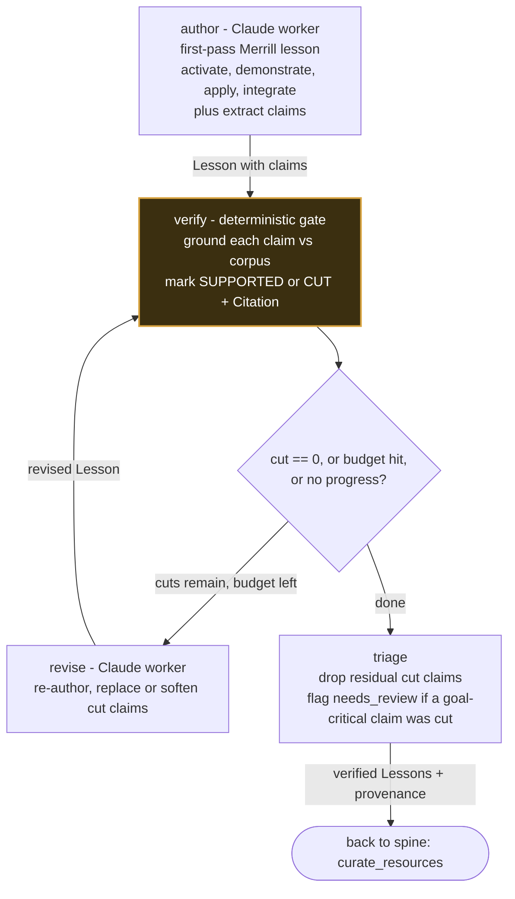

# The build pipeline — from a subject to a finished course

This traces what happens from the moment a learner submits a **subject** until a **Course** artifact
is built and persisted, on the default **agent** pipeline (`LUNARIS_PIPELINE=agent`,
`AgentCourseBuilder.run()` in
[`packages/agent/.../harness/runner.py`](../packages/agent/src/lunaris_agent/harness/runner.py)).

Every stage is a **tool the planning agent calls**; each tool writes its typed result onto a shared
`CourseDraft` (the model plans *when* to call, the tools own the *data*). Two stages are
**deterministic guarantees** the model cannot talk its way past.

The concrete values below come from a representative build of the request
*"Improve my English to reach CLB 10"* — chosen because it exercises both guarantees and ends in
`review` rather than `published`, which makes the verifier's behaviour visible.

---

## 1. The pipeline spine

```mermaid
flowchart TD
    U(["Learner submits a subject:<br/>Improve my English to reach CLB 10"])
    U -->|"raw request : str"| S1

    S1["1 - interpret_request<br/>Claude worker"]
    S1 -->|"CourseBrief"| S2

    S2["2 - research_standard<br/>Claude worker, best-effort"]
    S2 -->|"StandardResearch + research seeds"| S3

    S3["3 - model_learner<br/>Claude worker"]
    S3 -->|"LearnerProfile.frontier"| S4

    S4["4 - extract_concepts<br/>Claude worker"]
    S4 -->|"Extraction: 8 KCs + goal_id"| S5

    S5["5 - build_prerequisite_graph<br/>prerequisite ordering, deterministic"]
    S5 -->|"PrerequisiteGraph: 8 nodes, topoOrder, acyclic"| S6

    S6["6 - design_curriculum<br/>Claude strong"]
    S6 -->|"4 Modules: objectives, Bloom, assessment"| S7

    S7["7 - seed_grounding<br/>deterministic ingest"]
    S7 -->|"SeedReport: research pages to corpus"| S8

    S8["8 - discover_grounding<br/>Claude worker, best-effort"]
    S8 -->|"DiscoveryReport: evidence to corpus"| S9

    S9["9 - author lessons<br/>subagent loop, see section 3"]
    S9 -->|"Lessons with Merrill segments + provenance"| S10

    S10["10 - curate_resources<br/>Claude worker, best-effort"]
    S10 -->|"Resources attached to segments"| S11

    S11["11 - finalize_course<br/>deterministic assembly + critic gate"]
    S11 -->|"Course.model_dump_json by_alias"| OUT

    OUT(["Course persisted, status = REVIEW, see section 5"])

    classDef guarantee fill:#3b2f10,stroke:#d9a441,stroke-width:2px,color:#ffffff;
    classDef loop fill:#10263b,stroke:#4aa3df,stroke-width:2px,color:#ffffff;
    class S5 guarantee
    class S9 loop
```

> **Pipeline modes.** `agent` (above — the deep-agent harness, with discovery and the
> author/verify/revise loop) is the default. `live` runs the legacy single-shot `Orchestrator` (no
> discovery, one-pass authoring). `stub` runs the same `Orchestrator` with deterministic stubs
> (offline demo, no keys). Mode is chosen by `LUNARIS_PIPELINE`; factories live in
> [`apps/api/.../dependencies.py`](../apps/api/src/lunaris_api/dependencies.py).

---

## 2. The prerequisite graph (the ordering guarantee, in action)

Stage 5 is deterministic: it orders the extracted knowledge components into an **acyclic** graph and
emits a topological teaching order. The model cannot reorder it.

Topological order:
`advanced_vocabulary_breadth, complex_syntax_production, advanced_register_control,
implicit_inference_reading, varied_accent_fluency, idiomatic_precision, native_like_fluency,
clb_10_integrated_mastery`

Stage 6 then groups these 8 knowledge components into **4 modules** by backward design (see the table
in section 4).

---

## 3. The authoring loop (the grounding guarantee lives here)

Lessons are authored by a delegated subagent that runs a deterministic LangGraph loop
([`harness/authoring/loop.py`](../packages/agent/src/lunaris_agent/harness/authoring/loop.py)). The
**verifier is an independent, deterministic gate** — it grounds each authored claim against the
per-course corpus and marks it `SUPPORTED` or `CUT`. No cut claim ships.

> **Revise budget** is risk-tiered: `LOW` = 1 round, `HIGH` = 3 (hard cap 3). Termination is
> deterministic: stop when `cut == 0`, the cap is hit, or the cut set stops shrinking.

---

## 4. What this build passed through each stage

| # | Stage (impl) | Input | Output | Example value |
|---|---|---|---|---|
| - | user | - | `str` | `"Improve my English to reach CLB 10"` |
| 1 | `interpret_request` (worker) | raw request `str` | `CourseBrief` | goal = CLB 10 integrated mastery; settings: budget $5 / 30 min, qualityFloor `standard`, maxModules 12; risk tier `low` |
| 2 | `research_standard` (worker) | `CourseBrief` | `StandardResearch` + research seeds | CLB competency descriptors to seeds for the corpus (best-effort; offline means thin) |
| 3 | `model_learner` (worker) | `CourseBrief` | `LearnerProfile.frontier` | `frontier = []` (no prior assumed on this run) |
| 4 | `extract_concepts` (worker) | topic + brief + frontier | `Extraction` = `KnowledgeComponent[]` + `goal_id` | **8 KCs** from `advanced_vocabulary_breadth` (diff 0.10) to `clb_10_integrated_mastery` (diff 1.00, goal) |
| 5 | `build_prerequisite_graph` (deterministic) | `KnowledgeComponent[]` | `PrerequisiteGraph` | 8 nodes, 7 edges, `isAcyclic=true`, topoOrder (see section 2) |
| 6 | `design_curriculum` (strong) | `PrerequisiteGraph` (+ brief) | `Module[]` | **4 modules**: m0 *Advanced Expressive Language Foundations* (3 KCs, 3 objectives, 6 assessment items, competency "Share information with precision and fluency"); m1 *Nuanced Comprehension Across Modalities*; m2 *Idiomatic and Native-like Performance*; m3 *Integrated CLB 10 Mastery* (Bloom `create`) |
| 7 | `seed_grounding` (deterministic) | research seeds | `SeedReport` | ingest already-fetched research pages into the per-course corpus (no re-fetch) |
| 8 | `discover_grounding` (worker) | draft (KCs + modules + brief) | `DiscoveryReport` | search, vet, score, ingest evidence (best-effort; offline/keyless means thin corpus) |
| 9 | author loop (see section 3) | `Module[]` | `Lesson[]` + `Citation[]` | each module to 1 lesson with 4 **Merrill** segments. m0-l0: activate (3 claims), demonstrate (8 claims), apply (4 claims), integrate (3 claims); gagne 9 events; loadEstimate 18.0 |
| 10 | `curate_resources` (worker) | `Module[]` (+ brief) | `Resource[]` on segments | m0-l0 got 3 vetted resources, e.g. a video (trust `open`, cred 0.85) and an instructional reference guide (docs, trust `official`, cred 0.80) |
| 11 | `finalize_course` (deterministic + critic) | full draft | `Course` (persisted) | assembled, critic gate run, persisted with `status = review` |

---

## 5. The honest outcome of this run — why it ended in `review`, not `published`

This build is a useful example precisely because the verification step **fired hard**:

- The author wrote **59 claims** across all lessons.
- The corpus was thin (offline / no live search keys on this run), so the verifier could ground
  **none** of them: **59 CUT, 0 SUPPORTED**, and `provenance = []`.
- Because goal-critical claims were cut, `triage` flagged `needs_review`, the critic gate withheld
  publication, and the course was persisted with **`status = review`** instead of `published`.

That is the system working as designed — it would rather ship a reviewable, ungrounded-flagged course
than publish unsupported claims. Filling the per-course corpus (manual ingest, auto-discovery with
search keys, or research seeding) is what turns those CUTs into SUPPORTED citations and flips the
status to `published`. See [grounding.md](grounding.md) for the trust model behind that, and
[getting-started.md](getting-started.md#step-5--fill-the-corpus-so-citations-go-green) for the
hands-on steps.

---

## Legend

- **guarantee** = a deterministic property the model cannot override. There are two: prerequisite
  ordering (acyclic, topological) and claim verification (every published claim is grounded or cut).
- **worker / strong** = Claude tier. Worker (Haiku-class) handles extraction, interpretation,
  profiling, authoring, revision, discovery, curation; strong (Opus-class) handles the agent planner,
  the curriculum architect, and the independent claim assessor.
- **best-effort** = the stage degrades gracefully (e.g. offline) without failing the build.
- Schemas live in [`packages/runtime/.../schema/`](../packages/runtime/src/lunaris_runtime/schema/);
  the final `Course` is serialized camelCase via `Course.model_dump_json(by_alias=True)` by the
  `CourseStore`.

---

For where this pipeline runs in production — the Azure topology and why the build executes inline over
SSE — see **[deployment.md](deployment.md)**.
