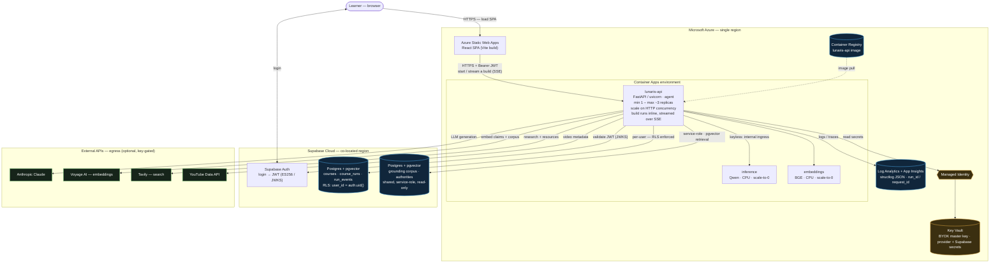

# Deployment

Lunaris runs on **Azure** for compute and **Supabase Cloud** for data and identity. A build executes
**inline inside the API request** and streams to the browser over SSE, so the hosting choices are
driven by long-lived streamed connections rather than short request/response traffic.

This page covers the production topology, the multi-tenancy and bring-your-own-key model, the keyless
Draft tier, and why the API runs on Container Apps.

---

## Topology

**Two paths through it.** The *request* path: the browser loads the SPA from Static Web Apps, signs in
against Supabase Auth (a JWT), and calls the Container Apps API with that bearer token; the API
validates the JWT and runs the build pipeline inline, streaming `run_events` back over SSE. The *data*
path: user-owned tables (`courses`, `course_runs`, `run_events`) are read and written **on behalf of
the user with RLS enforced** (`auth.uid()`), while the **shared grounding corpus** is read with the
service role (it's a global, read-only asset). Secrets never live in the image or env files — the API
fetches them from **Key Vault via its Managed Identity**; logs (carrying the `run_id` / `request_id`
correlation IDs used throughout these docs) stream to **Log Analytics**.

The pipeline traced in [build-pipeline.md](build-pipeline.md) is what executes inside that inline
request.

## Multi-tenancy and bring-your-own-key (BYOK)

Each tenant authenticates with Supabase (ES256, verified by the API via JWKS), and rows are isolated
by per-user RLS. Each tenant supplies their **own** provider keys, which are:

- stored **AES-GCM-encrypted**, with the master key read from **Key Vault — never the database**;
- injected into a run's **request context**, never the process environment, and never logged;
- redacted at the logging layer, so a key can never reach a log sink.

This means one deployment serves many tenants, each billing their own Anthropic / Voyage / Tavily
usage, with no shared-secret blast radius.

## The keyless Draft tier

When **no Anthropic key is reachable** for a build, Lunaris doesn't fail — it runs in a labelled
**Draft tier** on fully local, self-hosted models, so an unkeyed account can still build end to end
(at reduced quality, clearly marked in the UI):

| Capability | Keyed provider | Keyless fallback |
|---|---|---|
| Language model | Anthropic Claude | Qwen2.5-3B-Instruct (llama.cpp) |
| Embeddings | Voyage | BGE-large-en-v1.5 (llama.cpp) |
| Search | Tavily | DuckDuckGo |
| Video | YouTube | shared web search |

The fallbacks run as **scale-to-zero CPU sidecars** inside the same Container Apps environment
(`inference` and `embeddings`, reached over internal ingress). Routing is decided by the
Anthropic/LLM key alone: a keyed build uses the full hosted path unchanged; only an unkeyed build is
routed to the local models. The UI shows which capabilities are running on a fallback while a Draft
build is in progress.

## CI / CD

GitHub Actions builds the API image once and promotes it across environments: `cd-dev` deploys on
merge to the default branch, `cd-prod` is a one-click promote, and `cd-inference` builds the local
model images. The image is scanned for fixable high/critical vulnerabilities before it ships.

---

## Why Azure Container Apps, not App Service

Hosting the API on **Azure Container Apps (ACA)** rather than App Service is a deliberate choice driven
by this pipeline's execution model.

**The deciding factor — long, streamed builds.** A build runs **inline in the request and streams over
SSE for roughly 30 seconds to 5 minutes**. Azure App Service's front end enforces a **hard ~230-second
(3.8 min) idle timeout that cannot be raised** — it would cut long builds and SSE streams mid-flight.
ACA tolerates long-lived streamed connections (with the ingress timeout tuned and SSE heartbeats), so
the inline model works without a rewrite.

**Two more reasons ACA fits better:**

- **A clean path to a future worker/queue split.** If load grows past a handful of concurrent builds,
  the heavy build can move behind a queue and a long-running **worker container** with **KEDA
  queue-based autoscaling**, which ACA runs natively (App Service has no real background-worker
  primitive). The `run_events` transcript is what makes that split a drop-in: the browser would tail
  progress via Supabase Realtime instead of a held SSE connection.
- **Scale on HTTP concurrency**, with per-replica concurrency control — which matters because each
  build is heavy, so a replica should take only a few at once.

**App Service isn't impossible — but it costs a redesign.** App Service *can* run the container (Web
App for Containers) and is fine for short requests. To use it you'd have to **drop the held SSE stream
and switch the client to short-poll `run_events`** (to dodge the 230-second cut), and accept the
weaker background-work story. With today's inline-SSE design, **Container Apps is the right call** — and
it's typically a bit cheaper at idle on the consumption plan.

> **Rule of thumb:** long-lived/streamed or background-heavy → **Container Apps**. Short
> request/response web apps → App Service is fine. This pipeline is the former.

---

*See [architecture.md](architecture.md) for the system design these production pieces realize.*
