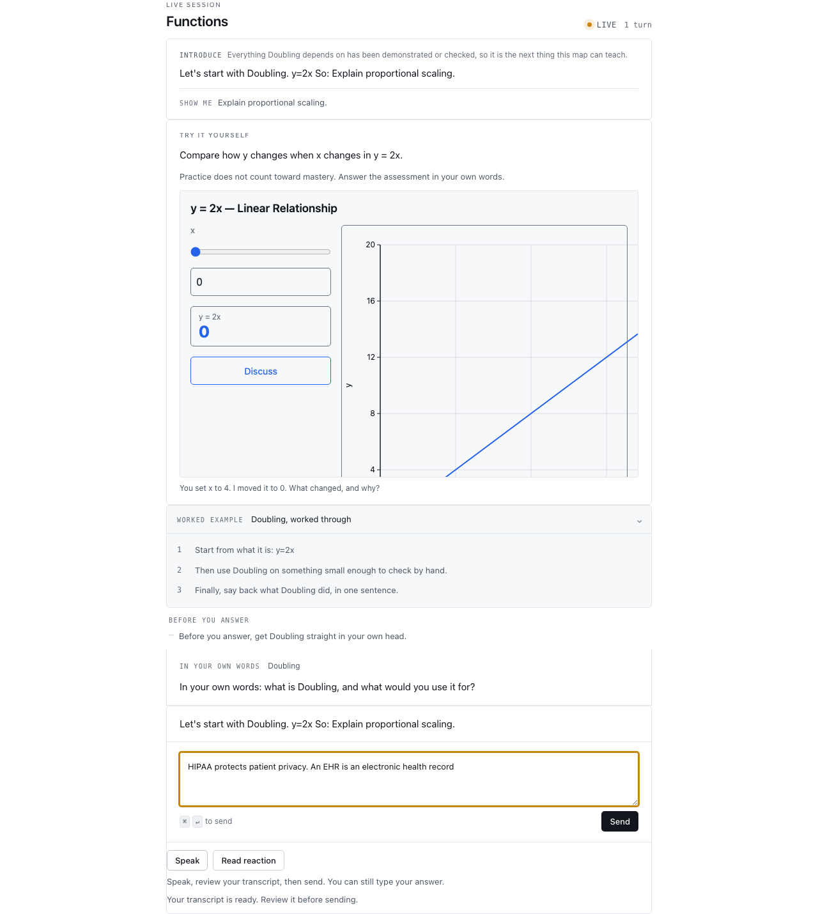

# Phase 4 voice evaluation

Real ElevenLabs George speech and Scribe v2 transcription succeeded using synthetic learning text. This is provider and transport evidence; it is not a human listening score or physical microphone acceptance.

| Measurement | Result |
|---|---|
| First speech PCM, privacy/acronym sample | 895 ms |
| First speech PCM, circuit sample | 217 ms |
| Generated audio durations | 5.43 s and 4.69 s |
| Transcription of saved speech | 1,311 ms |
| Word error rate, case/punctuation ignored | 0% |
| Submitted pronunciation-expanded characters | 149 |
| Actual billed USD | Unknown |

The privacy sample includes HIPAA and EHR. Canonical text remains unchanged; the speech adapter applies the established pronunciation substitutions. Listening approval remains pending. Full metrics are in [provider-results.json](provider-results.json). Audio artifacts remain in the ignored local evaluation directory.

The first transcription attempts were rejected because the key lacked Speech-to-Text permission. After the user enabled it, one retry using the saved WAV succeeded. No uncertain paid attempt was automatically retried.

Automated phase gates passed: 3,280 full Python tests, 1,811 web tests, 32 real database/Storage/API tests, 23 Copilot runtime tests, and six bounded-evaluator tests. Browser coverage includes simulator reactions, explicit transcript confirmation, closure/goodbye, mobile permission denial, interrupted playback, idempotent response replay, and the actual Copilot runtime bridge. Independent Python/test/style/UI/security reviews passed.

Production deployment and signed-in physical microphone acceptance are pending. Phase #262 remains open until those release checks finish.

## Combined browser/provider check

A real Chromium → Copilot runtime → authenticated fixture API → ElevenLabs run passed through simulator interaction, editable dictation, explicit assessment submission, session closure, and goodbye playback. It made exactly three TTS calls and one STT call. Speech first-PCM latency was 237–269 ms; transcription took 837 ms for 5.71 seconds of captured audio. The browser verified actual audio source start/end, not only a successful HTTP response.

This uses the actual production voice transport and Copilot bridge with an approved simulator, fixture session stores/tutor, and prerecorded synthetic microphone input. Production authentication/data isolation has separate real database/API test coverage. It does not establish physical-device or human listening acceptance.

[Browser evidence](browser-evidence.json) includes correlated operation metrics. The internal metering entry amount is zero when an exact model price is unavailable; it is not a statement that ElevenLabs charged zero. Actual billed dollars remain unknown.

