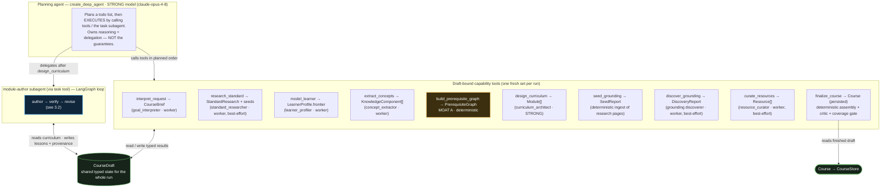
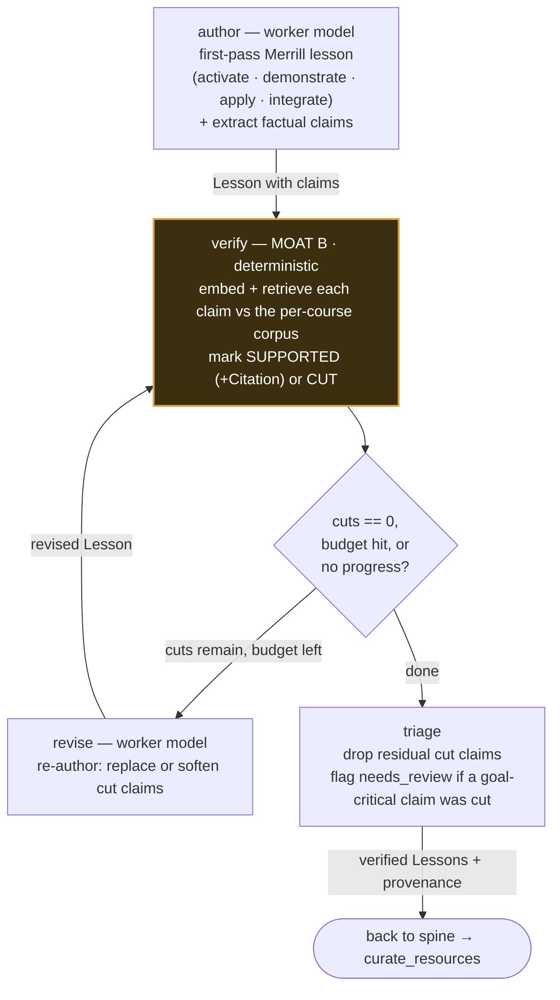
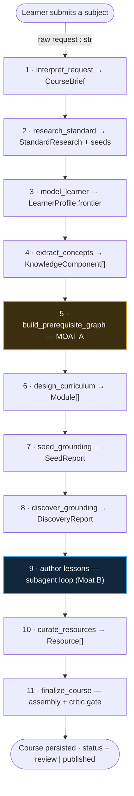
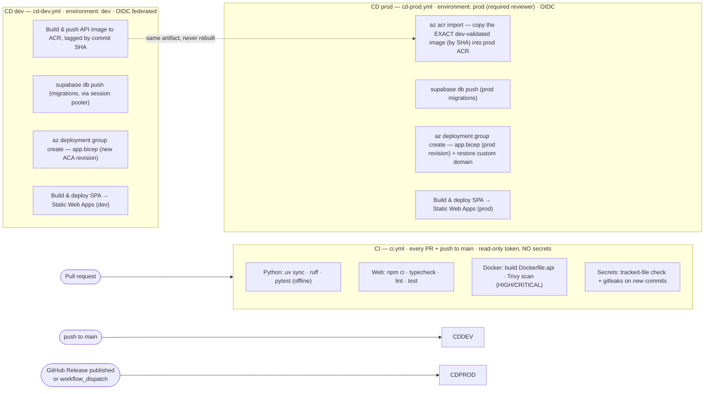

# Lunaris — System & Agent Architecture Overview

> A single, top-to-bottom tour of **what Lunaris is, how it works, how its agentic system is wired,
> and how it runs in production on Azure.** This document is grounded in the actual source tree
> (`packages/`, `apps/`, `infra/`, `.github/workflows/`), not just the top-level README.

---

## 1. The problem, and what Lunaris is

### The problem

Most "AI course generators" free-hand a course in **one shot**. The result is plausible prose that
fails in three predictable ways:

1. **Wrong order.** Concepts are taught before their prerequisites — coherent sentences, broken
   pedagogy.
2. **Unsupported claims.** Factual statements are asserted with no evidence and no citation; some are
   simply wrong.
3. **Wrong level / wrong scope.** Ask for *"Improve my English to CLB 10"* (an advanced band) and a
   naive generator starts from *"the English alphabet"* — correctly ordered, fully fluent, and
   useless to the actual learner.

The root cause is the same each time: a language model is asked to *be* the guarantee. It can always
talk its way past its own rules.

### What Lunaris is

**Lunaris turns a topic into a real, verified course.** You type a subject; an agent plans the
curriculum, writes the lessons, grounds every factual claim against evidence, and returns something you
can actually learn from — a prerequisite map, Merrill-structured lessons, curated resources, and claims
that carry their sources.

The defining design choice: **Lunaris is a genuinely agentic application, but the correctness
guarantees do not live in the model.** They live in deterministic code, exposed to the agent **as
tools**, so the model decides *what to do next* while the tools decide *what ships*.

Two of these tools are hard guarantees the team calls **moats**:

| Moat | Guarantee | Where it lives |
|---|---|---|
| **Moat A — prerequisite order** | The teaching sequence is an **acyclic topological order**. A concept is never taught before its prerequisites. The model cannot reorder it. | `packages/graph` (`PrerequisiteGraphBuilder`) |
| **Moat B — grounding** | Every factual claim is checked against retrieved evidence. Anything that can't be supported is **cut before publish**. | `packages/grounding` (`Verifier`) |

A third concern — **relevance** — is handled by the front of the pipeline (interpret the request →
research the real standard → model what the learner already knows → scope to the gap), so the moats
operate over *relevant, right-level* input rather than the whole subject.

---

## 2. What is used, and how it solves the problem

| Concern | Technology | How it solves the problem |
|---|---|---|
| **Agent harness** | `deepagents` (`create_deep_agent`) over **LangGraph** / LangChain | A planning agent that builds a todo list and *executes* it by calling capability tools and a delegated subagent — never reasoning the answer in its head. |
| **Model provider** | **Anthropic Claude**, two tiers — strong `claude-opus-4-8` (planner, curriculum architect, claim assessor) and worker `claude-haiku-4-5-20251001` (extraction, interpretation, authoring, revision, discovery, curation). Routed by `ModelRouter` / `ModelTier`. | Cheap bulk work goes to the worker; only planning and judgement spend the strong model. Tiers are swappable and settable in-app. |
| **Prerequisite ordering (Moat A)** | Deterministic graph builder, topological sort | Guarantees acyclicity + a teaching order the model is forced to trust. |
| **Grounding / retrieval (Moat B)** | **Supabase Postgres + pgvector**, **Voyage AI** embeddings, a claim-level `Verifier`, trust-tiered sources | Each claim is embedded, retrieved against the per-course corpus, and marked `SUPPORTED` (with a citation) or `CUT`. Authority emerges from corroboration, not from a label. |
| **Research & resource discovery** | **Tavily** search + **Trafilatura** extraction + a domain-trust model (`lunaris_grounding.discovery`); optional **YouTube Data API** for video | Fills the corpus and curates per-lesson resources from vetted external sources. Key-gated, with deterministic stubs when no key is present. |
| **Capability registry** | **FastMCP** (`lunaris-mcp`) | Exposes the moats as MCP tools that call the *same* cores as the in-process LangChain tools, so the two surfaces never drift. |
| **Course schema & persistence** | **Pydantic** schema (`packages/runtime`), `CourseStore`, structlog with correlation IDs + secret redaction | One typed `Course` object, serialized camelCase, with auditable run events. |
| **API** | **FastAPI** / uvicorn (`apps/api`) | `POST /api/courses`, an SSE build stream, a live agent transcript; selects the pipeline via `LUNARIS_PIPELINE`. |
| **Web** | **Vite + React + TypeScript** (`apps/web`) | A studio with run history, a live agent transcript, a lesson **Reader** (Merrill phases, claims-with-sources), and a prerequisite-graph **Map**. |
| **Eval** | `lunaris-eval` (offline checkers) | Independent verification of the definition of done: prerequisite order + factuality. |

**Graceful degradation is a first-class property.** Every external key is optional; its absence falls
back to a deterministic stub so the no-key path always works:

> ⚠️ **Active development.** The fallback / key-gated degradation mechanism is currently being
> reworked. The table below reflects the intended behavior, but the exact fallback paths (and the
> automatic pipeline selection in §3.4) may change — treat this section as a moving target until it
> settles.

| Key | Unlocks | Absent |
|---|---|---|
| `ANTHROPIC_API_KEY` | Live Claude (`agent`/`live` pipelines) | Deterministic `stub` pipeline |
| `SEARCH_API_KEY` (Tavily) | Research + curated resources | `research: unavailable`, no resources — course still builds at the right level |
| `YOUTUBE_API_KEY` | Richer video metadata | Video candidates via the shared search |
| `EMBEDDINGS_API_KEY` (Voyage) + Supabase | Real pgvector grounding → citations | Verifier fails safe (cuts every claim → *Needs review*) |

---

## 3. Agentic system architecture

Lunaris runs as a **deep-agent harness**: one planning agent (the strong model) plans the build, calls
**capability tools** that each write their typed result onto a shared `CourseDraft`, and **delegates**
lesson authoring to a `module-author` subagent reachable through the `task` tool. Two tools are the
deterministic moats; `finalize_course` is the deterministic assembly + critic gate.

> Source of truth: `AgentCourseBuilder.run()` in
> `packages/agent/src/lunaris_agent/harness/runner.py`, the agent in `harness/agent.py`, the tools in
> `harness/tools/`, and the subagents in `subagents/`.

### 3.1 The agent, its tools, and its subagent



**Key idea:** the agent plans *when* to call each tool; the tool owns the *data and the guarantee*.
Lesson authoring + verification are deliberately **not** plain tools — they are delegated to a subagent
so the main agent reasons about *when* to author and the loop owns *how*.

### 3.2 The author → verify → revise subagent (Moat B lives here)

Delegated once, after `design_curriculum` and before `finalize_course`. It authors each module's
Merrill lesson, then runs a deterministic verify/revise loop. The **verifier is an independent
deterministic gate** — no cut claim ships.



> **Revise budget is risk-tiered:** `LOW` = 1 round, `HIGH` = 3 (hard cap 3). Termination is
> deterministic — stop when `cut == 0`, the cap is reached, or the cut set stops shrinking.

### 3.3 The full build spine

End-to-end, a request flows through eleven stages. Every stage is a tool the agent calls; the moats
(amber) and the authoring loop (blue) carry the guarantees.



### 3.4 Subagents and capabilities at a glance

| Subagent / capability | Module | Tool it backs | Tier |
|---|---|---|---|
| Goal interpreter | `subagents/goal_interpreter` | `interpret_request` | worker |
| Standard researcher | `subagents/standard_researcher` | `research_standard` | worker |
| Learner profiler | `subagents/learner_profiler` | `model_learner` | worker |
| Concept extractor | `subagents/concept_extractor` | `extract_concepts` | worker |
| Curriculum architect | `subagents/curriculum_architect` | `design_curriculum` | **strong** |
| Module author (+ verify/revise) | `subagents/module_author`, `harness/authoring` | delegated via `task` | worker (Moat B deterministic) |
| Resource curator | `subagents/resource_curator` | `curate_resources` | worker |
| Scope polisher *(optional)* | `subagents/scope_polisher` | finalize-stage wording polish | worker |
| Visual agent | `subagents/visual_agent` | branded diagrams at finalize | worker |
| Grounding seeder / discoverer / verifier | `harness/seeding`, `harness/discovery`, `packages/grounding` | `seed_grounding`, `discover_grounding`, Moat B | worker / deterministic |

**Pipeline modes** (`LUNARIS_PIPELINE`): `agent` (default — the deep-agent harness above), `live`
(legacy single-shot `Orchestrator`, no discovery), `stub` (the same orchestrator with deterministic
stubs — offline, no keys). The MCP server (`lunaris_agent.mcp_registry`) re-exposes the two moats as
FastMCP tools for external callers.

---

## 4. System architecture (Azure)

Lunaris is served on **Microsoft Azure** with **Supabase Cloud** as the data + identity plane and a
handful of external APIs for egress. At pilot scale the whole agent build runs **inline inside the API
request** and is streamed to the browser over **SSE** — there is no separate worker/queue yet (that's a
deferred phase).

### 4.1 Production topology

```mermaid
flowchart TB
    User(["Learner — browser"])

    subgraph azure["Microsoft Azure — single region"]
        SWA["Azure Static Web Apps<br/>React SPA (Vite build)"]
        API["Azure Container Apps · lunaris-&lt;env&gt;-api<br/>FastAPI / uvicorn · min 1 – max ~3 replicas<br/>scale on HTTP concurrency<br/>build runs inline, streamed over SSE"]
        MI{{"User-assigned Managed Identity"}}
        KV[("Key Vault<br/>provider + Supabase secrets")]
        ACR[("Container Registry (ACR)<br/>lunaris-api image, by SHA")]
        LOG[("Log Analytics + App Insights<br/>structlog JSON · run_id / request_id")]
    end

    subgraph supa["Supabase Cloud — co-located region"]
        AUTH["Supabase Auth<br/>login → JWT (ES256 cloud / HS256 local)"]
        TUSER[("Postgres + pgvector<br/>courses · course_runs · run_events<br/>RLS: user_id = auth.uid()")]
        TCORP[("Postgres + pgvector<br/>grounding corpus · source_authorities<br/>shared · service-role · read-only")]
    end

    subgraph extapi["External APIs — egress"]
        ANT["Anthropic Claude<br/>Opus (strong) + Haiku (worker)"]
        VOY["Voyage AI — embeddings"]
        TAV["Tavily — search"]
        YT["YouTube Data API"]
    end

    User -->|HTTPS — load SPA| SWA
    User <-->|login (magic-link / OAuth)| AUTH
    SWA -->|HTTPS + Bearer JWT · start / stream build (SSE)| API

    API -->|validate JWT (JWKS / shared secret)| AUTH
    API -->|per-user · RLS enforced| TUSER
    API -->|service-role · pgvector retrieval| TCORP

    API -->|read secrets via RBAC| MI
    MI --> KV
    ACR -.->|image pull| API
    API -->|logs / traces| LOG

    API -->|LLM generation| ANT
    API -->|embed claims + corpus| VOY
    API -->|research + resources| TAV
    API -->|video metadata| YT

    classDef store fill:#10263b,stroke:#4aa3df,stroke-width:1.5px,color:#fff;
    classDef secret fill:#3b2f10,stroke:#d9a441,stroke-width:1.5px,color:#fff;
    classDef egress fill:#16241a,stroke:#5fae5f,stroke-width:1.5px,color:#fff;
    class TUSER,TCORP,LOG,ACR store
    class KV,MI secret
    class ANT,VOY,TAV,YT egress
```

**Two paths through it.**

- **Request path:** the browser loads the SPA from **Static Web Apps**, signs in against **Supabase
  Auth** (receiving a JWT), and calls the **Container Apps** API with that bearer token. The API
  validates the JWT and runs the §3 pipeline inline, streaming `run_events` back over SSE.
- **Data path:** user-owned tables (`courses`, `course_runs`, `run_events`) are read/written **on
  behalf of the user with Row-Level Security** (`auth.uid()`); the **shared grounding corpus** is read
  with the **service role** (it's a global asset).

**Secrets never live in the image or env files.** The API fetches provider + Supabase secrets from
**Key Vault** via its **user-assigned Managed Identity** (RBAC: *Key Vault Secrets User* on the vault,
*AcrPull* on the registry — both granted in `infra/main.bicep`).

### 4.2 Auth

- **Provider:** Supabase Auth issues the JWT (magic-link / OAuth).
- **Verification:** the API's `CompositeUserVerifier` routes a token by its header `alg` — **HS256**
  (local / shared-secret Supabase) to the HMAC arm, **ES256/RS256** (cloud) to the **JWKS** arm. Each
  arm holds only its own key material, which structurally defeats the alg-confusion attack.
- **Authorization:** Postgres **RLS** scopes every user row to `auth.uid()`; the corpus is
  service-role read-only.

### 4.3 Infrastructure as code

Two Bicep templates split *platform* from *app*:

- **`infra/main.bicep`** — the stable platform per environment (`dev` | `prod`): Log Analytics, the
  Container Apps managed environment, ACR, Key Vault (RBAC auth, purge-protected in prod), the
  user-assigned Managed Identity + its `AcrPull` and `Key Vault Secrets User` role assignments, and the
  Static Web App. Deployed out-of-band by an Owner.
- **`infra/app.bicep`** — the Container App itself (one revision per image). Rolled by CD.
- Parameter files: `main.dev.bicepparam`, `main.prod.bicepparam`.

### 4.4 CI/CD



Highlights:

- **Build-once, promote.** `cd-prod.yml` **never rebuilds**. It `az acr import`s the exact image the
  dev pipeline already built and validated (by commit SHA) into the prod registry, then rolls a prod
  revision from that same artifact. Prod is a gated GitHub Environment with a required reviewer.
- **OIDC federation, no stored cloud credentials.** `azure/login` exchanges a GitHub OIDC token scoped
  to `environment:dev` / `environment:prod`; CD runs least-privilege (Contributor + AcrPush/Pull).
- **DB migrations** are pushed with `supabase db push` over the IPv4 **session pooler** (`--db-url`,
  password only — the direct DB host is IPv6-only and unreachable from the runner).
- **Fork-safe CI.** The CI workflow runs with a read-only token and no secrets, so forked-PR
  contributions are safe to gate.

### 4.5 Why Container Apps (not App Service)

A build runs **inline in the request and streams over SSE for ~30 s – 5 min**. Azure App Service's
front end enforces a hard **~230-second idle timeout that cannot be raised**, which would cut long
builds mid-flight. **Azure Container Apps** tolerates long-lived streamed connections, scales on HTTP
concurrency with per-replica limits (each build is heavy), and gives a clean path to the deferred
Phase-4 **queue + worker** split (KEDA queue autoscaling) — at which point the browser would tail
progress via **Supabase Realtime** on `run_events` instead of a held SSE connection.

---

## Legend & sources

- **MOAT** = a deterministic guarantee the model cannot override. **A** = prerequisite ordering
  (acyclic, topological). **B** = claim verification (every published claim is grounded or cut).
- **strong / worker** = Claude tiers — strong `claude-opus-4-8` (planner, curriculum architect, claim
  assessor); worker `claude-haiku-4-5-20251001` (extraction, interpretation, profiling, authoring,
  revision, discovery, curation).
- **best-effort** = the stage degrades gracefully (offline / no key) without failing the build.

Primary sources in-repo:
`packages/agent/src/lunaris_agent/harness/` (agent, runner, tools, authoring, discovery, seeding) ·
`packages/agent/src/lunaris_agent/subagents/` · `packages/graph` (Moat A) ·
`packages/grounding` (Moat B + discovery) · `packages/runtime/.../schema/` ·
`apps/api/src/lunaris_api/` (auth, routers, dependencies) · `apps/web` ·
`infra/main.bicep` + `infra/app.bicep` · `.github/workflows/{ci,cd-dev,cd-prod}.yml`.

Companion docs: [course-build-pipeline.md](course-build-pipeline.md) ·
[relevance-model.md](relevance-model.md) · [grounding-model.md](grounding-model.md) ·
[build-a-course-walkthrough.md](build-a-course-walkthrough.md).
